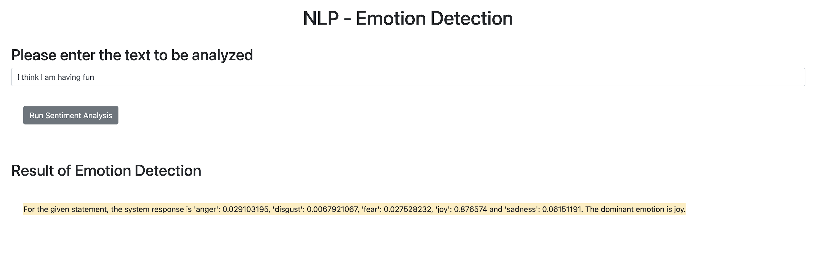

# Emotion Detection

A Flask web app that detects emotions in text using Watson NLP. Built as the final project for IBM's *Developing AI Applications with Python and Flask*.



## Features

- Detects five emotions: anger, disgust, fear, joy, and sadness
- Returns the dominant emotion for any input text
- Handles blank/invalid input gracefully
- Packaged with unit tests and static error handling

## Project Structure

```
EmotionDetection/     # Core emotion detection package
static/               # JS assets
templates/            # index.html
server.py             # Flask app entry point
test_emotion_detection.py
```

## Run It

```bash
python server.py
```

Then open http://localhost:5000 in your browser.

## Built With

- Python
- Flask
- Watson NLP (embeddable AI library)
- HTML / JavaScript
